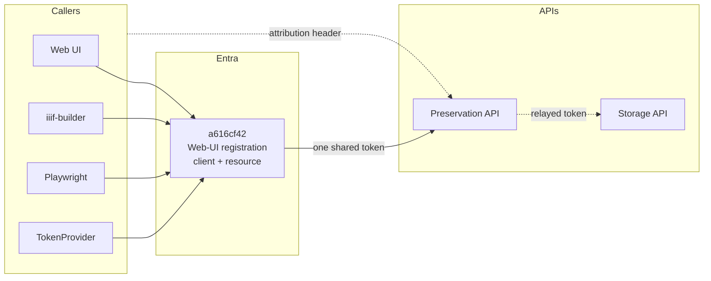
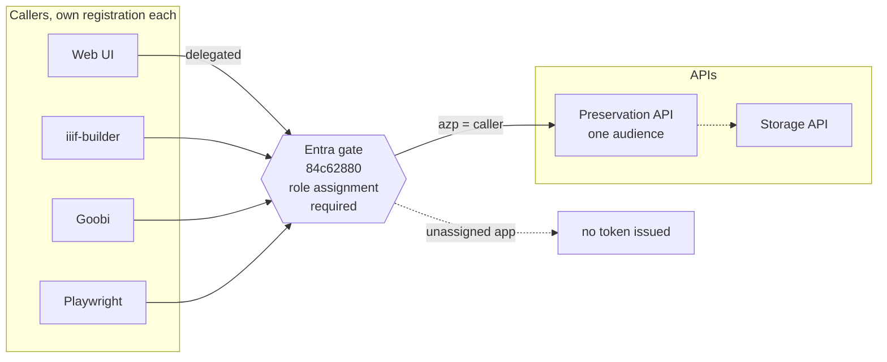
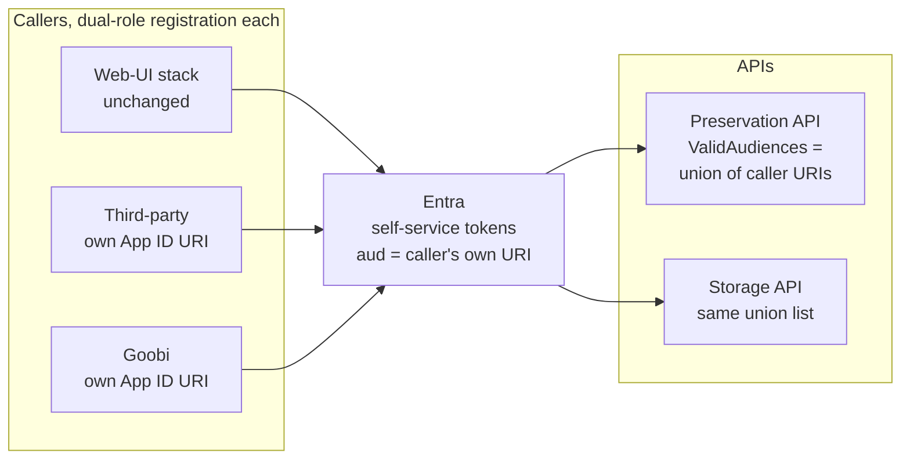

# RFC-0001 vs LPII-166: two shapes for trustworthy caller identity

| | |
|---|---|
| **Status** | Draft / for discussion |
| **Author** | Tom Crane (with assistance from Fable 5) |
| **Date** | 2026-08-24 |
| **Compares** | [`rfc-0001-api-caller-identity.md`](./rfc-0001-api-caller-identity.md) (the "Option A" proposal) with the Digirati-Entra POC in [LPII-166](https://digirati.atlassian.net/browse/LPII-166), branch [`feat/LPII-165/entra-api`](https://github.com/digirati-co-uk/digital-preservation/tree/feat/LPII-165/entra-api) |
| **Related** | [`rfc-0001-phase0-entra-admin.md`](./rfc-0001-phase0-entra-admin.md), [ADR-005 Auth setup](https://github.com/digirati-co-uk/digital-preservation-docs/blob/main/adr/005-auth-setup.md) |

## 1. Summary

LPII-166 tested the caller-identity migration on Digirati's own Entra tenant, mirroring the Leeds setup. The experiment succeeded, and it is extremely useful — but it is not simply "the RFC, proven": underneath shared code mechanics sits a **different Entra topology**.

One framing note before comparing. The ticket's write-up lists its own goals, including *"little or no code changes (if possible)"* and *"UI application stack should stay the same as far as Entra is concerned"*. Those were the POC's self-set optimisation targets, and they largely explain why its design landed where it did — but **they are not project goals**. Minimising code change in this repository was never a constraint; the project's goals are RFC-0001's G1–G5 (trustworthy identity, revocability, least privilege, an enforced caller list, incremental migration), and the genuinely scarce resource is **Leeds Entra admin actions**, not lines of code. This document therefore weighs the two approaches against the RFC goals and the admin burden, and treats code-change volume as a non-factor.

- **RFC-0001 (Option A)**: *one audience, N clients.* Every caller — including, eventually, the UI's downstream calls — requests a token **for the API** (`api://84c62880…/.default`). Caller identity comes from the signed `azp` claim; authorization comes from per-caller **app-role assignments** on the API registration, enforced by Entra (`Assignment required = Yes`) and by the API (role-or-scope check).
- **LPII-166**: *one audience per caller.* Each third-party caller gets a **dual-role registration** — client *and* resource — exposing its own Application ID URI (e.g. `api://digirati.com/preservation.thirdparty`) and minting tokens **for itself**. The APIs accept the **union** of caller URIs via `ValidAudiences`. The UI stack is untouched.

Put another way: RFC-0001 is a course-correction back to ADR-005 (per-API audience, app roles); LPII-166 takes the current "collapsed" pattern — where the resource identity is the *caller's* registration — and **clones it per caller**. The audience itself becomes the caller's identity.

The two agree completely on the *mechanics* (§4): the POC's `PostConfigure<JwtBearerOptions>` code is the code-side `TokenValidationParameters.ValidAudiences` form the RFC's Phase 0 already names, and it independently confirms the RFC's empirical findings. The POC's code changes work unmodified for **either** topology — the choice between §2 and §3 below is an Entra-administration and security-posture decision, not a code decision.

**Recommendation (§7): adopt the POC's mechanics; keep the RFC's topology as the target.** The POC's topology is held only as a **recorded contingency** (§7.3), not a recommended stopgap — Goobi is delivered at RFC Phase 1 anyway, so the contingency pays for schedule insurance the plan does not need unless admin throughput actually collapses. Two implementation defects on the POC branch need fixing before any of its code merges (§6).

> [!TIP]
> Entra overloads several everyday words — *audience*, *scope*, *assignment*, *known client* — with meanings narrower than they sound, and both this document and the POC depend on those distinctions. The [Glossary](#appendix-glossary) at the end defines each term as used here, citing Microsoft's documentation.

## 2. Today, and the RFC-0001 target

For grounding, the current state (RFC §3): every caller authenticates *as* the Web-UI registration and requests the Web-UI registration as the audience. The only per-caller discriminator is the self-asserted `X-Client-Identity` header.

To be clear about what that header is and is not: it was always known to be spoofable, and that was an **acceptable, deliberate trade-off** while it served only attribution (logs, METS authorship) among trusted, Entra-authorised internal callers — RFC §2.2 says exactly this ("this is not a security hole, because we don't Authorise based on this header"). What has changed is the arrival of a **third party**: Goobi's deposits must be routed to a Goobi-only bucket **because of who is calling**, which turns caller identity from an audit label into an authorization/data-isolation input (RFC §1.1) — a job a self-asserted header was never suitable for. That change of requirement, not a newly discovered flaw, is what both RFC-0001 and LPII-166 respond to.



Reading the diagram:

- Every caller authenticates with the **same** `client_id` (`a616cf42`) and requests the **same** scope, `api://a616cf42/.default` — so every token carries `azp = a616cf42` and the APIs validate that single audience.
- `a616cf42` is both client and resource; `Assignment required = Yes` with a **self-assignment** is the linchpin that lets it mint app-only tokens for its own API (RFC §3.1).
- The dashed `X-Client-Identity` header is the only per-caller discriminator — fine as the attribution label it was designed to be, unusable as an input to authorization decisions like bucket routing (see above).

RFC-0001's target: the API registration becomes the single audience; each caller is its own client, gated by an app-role assignment that Entra enforces at token issue.



Reading the diagram:

- Every caller — the UI's downstream calls included — requests the **API's** audience: `api://84c62880…/.default`. Machine callers use their own secret (client credentials); the UI uses the delegated flow, which requires the `access_as_user` delegated scope, consented (Phase 0/3).
- Tokens carry `aud = api://84c62880…`, `azp` = the actual caller, and `roles = Preservation.Call` (machines) or `scp` (humans). Identity resolves via `KnownClients` off the signed `azp`; the API enforces role-or-scope (§5.3 of the RFC).
- The enforcement lives in **Entra**: with `Assignment required = Yes` on `84c62880`, an unassigned app is refused a token outright (`AADSTS501051`), and the portal's assignment list *is* the "who may call me" list (goal G4).
- Storage currently shares the audience via the relayed token; a Storage-specific audience is the §8 Q1 follow-up.

## 3. The LPII-166 model

Each third-party caller mirrors the Web-UI's dual-role setup: it exposes its **own** API (Application ID URI + scope), pre-authorizes **itself** (the "Self — oddity in Entra" step, which is the same self-assignment linchpin RFC §3.1 identified on `a616cf42`), and mints client-credentials tokens for its own URI. The resource APIs then accept the union of caller URIs.



Reading the diagram:

- Each caller is client **and** resource: it exposes its own Application ID URI (e.g. `api://digirati.com/preservation.thirdparty`), pre-authorizes itself, and requests `{own URI}/.default` with its own secret — a token minted *for itself*, which the APIs accept because its URI is in their `ValidAudiences` list.
- Tokens carry `aud` = the caller's own URI and `azp` = the caller (they coincide); there is **no `roles` claim**.
- The Web-UI stack keeps the current collapsed pattern unchanged — its own URI is simply one entry in the union.
- The per-caller gate is `Assignment required` on **each caller's own registration** — the load-bearing hygiene step §5.4 examines.
- The POC also pre-authorizes Storage API and Preservation API as clients of the third-party registration — purpose unclear (§8 Q3).

Properties worth calling out:

- **The caller's identity is doubly present** — as `aud` *and* as `azp` — and both are signed. The RFC's `KnownClients`/`azp` resolution (already implemented on this branch) works unchanged in this model.
- **The allow-list moves out of Entra and into appsettings**: a caller can call an API iff its URI appears in that API's `ValidAudiences` array. Onboarding or revoking a caller means editing (and redeploying/restarting) **every** API's config, per environment.
- **No cross-app grant ever happens.** Each caller only ever talks to Entra about itself. This is why the model needs *no* admin actions on `84c62880`, no admin consent, no delegated-scope work — and it is the source of both its main advantage (§5.1) and its main risk (§5.4).
- **The Web-UI's collapsed pattern is not corrected — it is legitimised** as "the platform's own audience", one entry among N.

## 4. Where the POC confirms RFC-0001 (the shared mechanics)

The POC independently reproduces three findings from the RFC's adversarial review — this materially raises confidence in both documents:

1. **Multiple audiences only work through `TokenValidationParameters.ValidAudiences`.** The POC's "conflicting documentation on multiple audiences" remark, and its solution — `PostConfigure<JwtBearerOptions>` setting `TokenValidationParameters.ValidAudiences` — match the RFC Phase 0 CAUTION (a top-level `Audiences` key binds to nothing; verified against Microsoft.Identity.Web 3.8.3, pinned by `Storage.API.Tests/Integration/AudienceValidationTests.cs`).
2. **The self-assignment oddity is real.** The POC hit it as a required setup step ("Assign Client applications → Self"); RFC §3.1 identified the same self-entry on `a616cf42` as the linchpin that lets a registration mint app-only tokens for its own API.
3. **`AccessTokenProvider` cannot target a foreign resource without a code change.** The POC's `ResourceUri` option is exactly RFC Phase 2 option (a) / the §8 Q1 constraint — independent confirmation that migrating the `TokenProvider` callers is not config-only.

The POC also demonstrates two things the RFC had not tested:

4. **A guarded, deploy-then-activate rollout pattern** (§7.1) that is operationally safer than the RFC's config-only Phase 0 shape.
5. **Human-readable Application ID URIs** (`api://digirati.com/preservation.dev` rather than `api://<guid>`). Entra requires the URI be based on a verified domain, the tenant ID, or the client ID; within that rule readable names work fine. Adoptable under either topology; the POC's own note for Leeds is right — the current UI scope can stay as-is, readable names for anything new. The RFC's bare-GUID hardening note still applies: a v2.0 token's `aud` is the bare client GUID regardless of how pretty the `api://` URI is, so an explicit `ValidAudiences` list should consider carrying both forms.

## 5. Detailed comparison

### 5.1 Against the RFC's goals

| Goal | RFC-0001 (single audience + roles) | LPII-166 (per-caller audiences) |
|---|---|---|
| **G1** — identity from the signed token, never a header | ✅ `azp`, validated | ✅ `aud` and `azp`, both validated |
| **G2** — machine callers distinguishable and individually revocable | ✅ own registration + secret; revoke = remove role assignment (Entra) | ✅ own registration + secret; revoke = remove URI from every API's config **and/or** disable the app |
| **G3** — least privilege per caller | ✅ app roles: can-call now, read/write split available, per-endpoint roles possible (RFC §5.3.1, e.g. gating Storage `GET /content`) | ❌ binary can-call only. There is no meaningful place to define roles: a role on the caller's own registration, self-granted, is not an API-controlled permission |
| **G4** — a real, enforced "who can call me" list in the portal | ✅ the assignment list on `84c62880` *is* the list, enforced at token issue | ⚠️ the list is an appsettings array per API per environment; the portal shows N unrelated registrations. Enforced at *validation* time, not issue time |
| **G5** — incremental migration | ✅ dual-audience transition, callers move one at a time | ✅ arguably *more* incremental — each caller is purely additive; nothing existing moves at all |

### 5.2 Entra administration burden (the POC's big win)

This is where LPII-166 is decisively cheaper, and given that every action on the Leeds tenant is a negotiated admin request, it matters:

| Admin action needed | RFC-0001 | LPII-166 |
|---|---|---|
| Touch `84c62880` at all (App ID URI, app role, delegated scope) | Required (Phase 0) | **Not needed** |
| Admin consent for cross-app permissions | Required per caller (Phase 1) | **Never** — no cross-app grant exists |
| Repoint the UI's downstream scope (Phase 3) | Required, with prerequisites (delegated scope consented; every UI user assigned or `AADSTS50105`) | **Phase 3 disappears** — UI untouched |
| Strict assign-then-repoint ordering (`AADSTS501051`) | Required per caller (Phase 2) | Not applicable |
| Retire `api://a616cf42` as an audience (Phase 4) | The end state | Never happens — it stays as "the platform's audience" |
| Per new caller | Create registration, assign role, admin consent | Create dual-role registration (expose API, self-authorize, **set Assignment required — §5.4**), then edit every API's `ValidAudiences` |

For **Goobi specifically** — the RFC's driving use case — the POC model delivers a cryptographically distinct, bucket-routable identity with *one new registration and one config line per API*, touching nothing that exists.

### 5.3 What the POC model gives up

- **Preservation/Storage separation stays broken by construction.** The POC assigns both APIs to each caller's URI, so a token minted for one is valid at both — RFC §3.2 consequence #5 persists, and the §8 Q1 follow-up (Storage's own audience) has no path. Under the RFC, that split is a natural extension of the same pattern.
- **Config sprawl as the enforcement surface.** The security-critical allow-list lives in N copies of appsettings rather than one portal page; drift between Preservation's and Storage's lists, or between environments, is a quiet failure mode. (Mitigable: bind the list once in shared config, and pin it with the same style of integration test as `AudienceValidationTests` — but it is still config, not Entra.)
- **The scaling ceiling the POC itself names**: "good enough for a dozen or two external apis; beyond that API gateway type should be the way to go." The RFC model scales in Entra without config growth.
- **ADR-005 conformance.** The RFC is explicitly a course-correction back to ADR-005; the POC model formalises the drift instead. That is a legitimate choice, but it should be made knowingly, and ADR-005 amended if so.

### 5.4 ⚠️ The impersonation gate the ticket does not mention

Under the RFC model there is **one** gate to get right: `Assignment required = Yes` on `84c62880` (already set — RFC §3 warning).

Under the POC model there are **N** gates, one per caller, forever: each caller's dual-role registration must have **`Assignment required = Yes` on its own enterprise application, with only itself assigned**. Otherwise **any registration in the tenant** can request `api://…/preservation.thirdparty/.default` via client credentials, receive a valid token with that audience, and impersonate that caller at our APIs — RFC §3.1 demonstrated exactly this dynamic on `a616cf42`, where the assignment gate is the only thing preventing it.

LPII-166's write-up does not state whether the third-party registration in the Digirati mirror has this set. **This must be confirmed, and if the model is adopted anywhere it must be a mandatory onboarding step** — it is the per-caller equivalent of the single gate the RFC relies on, and it is precisely the kind of hygiene step that silently doesn't happen on the twelfth caller.

The deeper problem is the *direction* of the failure. The RFC's per-caller step (a role assignment) is **fail-closed**: forget it, and the caller's very first token request is refused (`AADSTS501051`) — the omission is discovered during onboarding and cannot ship broken. The LPII-166 step is **fail-open**: forget it, and everything works perfectly while the platform is silently impersonable, with no symptom to notice. Fail-closed steps enforce themselves; fail-open steps need auditing forever (e.g. a Graph query over the caller registrations' `appRoleAssignmentRequired` — custom monitoring this model requires in order to stay safe).

### 5.5 Rollout risk

| Risk | RFC-0001 as written | LPII-166 |
|---|---|---|
| Phase 0 config typo | `AzureAd:TokenValidationParameters:ValidAudiences` is config-only; with the singular `Audience` removed, a mis-shaped key silently falls back to ClientId-derived defaults → **outage** (the exact defect the RFC's CAUTION documents; mitigated by `AudienceValidationTests`) | Guarded code: if `Authentication:ValidAudiences` is absent or empty, nothing changes and the old `Audience` still applies → a typo **degrades to current behaviour** |
| Deploy/activate coupling | Config change is the activation | Code deploys everywhere first (inert), config activates per environment |
| `TokenProvider` migration | Explicitly flagged as not-config-only; two options offered | Implemented (option (a)) — but currently defective (§6) |

The guarded-rollout point is a genuine improvement the RFC should adopt regardless of topology (§7.1).

## 6. Defects on the POC branch

Two problems in `feat/LPII-165/entra-api` (commits `241d76b`, `8b249aa`) need fixing before any of its code merges. Neither invalidates the design — both are in `AccessTokenProvider.cs`.

### 6.1 The null-check regression breaks the "defensive deploy" claim

`AccessTokenProvider.GetAccessToken()` has a pre-existing reflection guard:

```csharp
var nullCheck = options.GetType()
    .GetProperties()
    .Select(pi => pi.GetValue(options))
    .Any(value => value == null);

if (nullCheck) { /* warn "not configured correctly" and return null */ }
```

Adding `ResourceUri` to `AccessTokenProviderOptions` means **any deployment without the new config key now fails this check** — the provider logs a warning and returns no token, so every service-to-service call that has no inbound user token to relay (the `PropagateCorrelationIdHandler` fallback path) breaks on deploy. This directly contradicts the ticket's conclusion that "as the code stands, it can be deployed with current configuration setting as it's defensive". The `Program.cs` guard *is* defensive; this isn't. Fix: exclude optional properties from the check (or replace the reflection check with explicit required-field validation).

### 6.2 The `resource` parameter targets the wrong app — and the path was likely never exercised

In the new branch:

```csharp
if (options.ResourceUri is not null)
{
    collection.Add(new("scope", $"{options.ResourceUri}/.default"));
    collection.Add(new("resource", $"{options.ClientId}"));   // ← bare CALLER guid
}
```

The request goes to `https://login.microsoftonline.com/{tenant}/oauth2/token` — the **v1** endpoint, which honours `resource` and does not use `scope`. As written, this should mint a token whose `aud` is the caller's **own** bare client GUID — a token for itself, which neither API's `ValidAudiences` list would accept. The intended line is surely `resource = ResourceUri`.

The POC's end-to-end test minted the third-party token **manually in Postman**, which bypasses this code path entirely — so the defect could sit undetected. Better than patching the line: move to the v2 endpoint (`/oauth2/v2.0/token`), where `scope={ResourceUri}/.default` is the native form and `resource` disappears — RFC Appendix B already asks for exactly this "while touching it".

### 6.3 Minor (not blocking)

- The `PostConfigure` block is duplicated verbatim in both `Program.cs` files and reads the config section twice; it should be hoisted into one extension method in `DigitalPreservation.Core` (where `AudienceValidationTests` can pin it — see §7.1).
- The `AddAuthentication(options => { DefaultAuthenticateScheme/DefaultChallengeScheme … })` change is behaviourally equivalent to the previous `AddAuthentication(JwtBearerDefaults.AuthenticationScheme)`; fine either way.

## 7. Recommended synthesis

The mechanics and the topology are separable. Take the best of each.

### 7.1 Adopt the POC's mechanics (either topology)

- **The guarded `PostConfigure` rollout pattern** replaces the RFC's config-only Phase 0 shape: deploy the code everywhere (inert without config), activate per environment by adding `ValidAudiences`, keep the old `Audience` key in place as the fallback until activation. Hoist to a single shared extension in `DigitalPreservation.Core`.
- **Config location** needs one decision: the POC's new top-level `Authentication:ValidAudiences` section vs keeping it inside `AzureAd` (e.g. `AzureAd:ValidAudiences`, read by the same guarded code). Either works; whichever is chosen, **`AudienceValidationTests` must be re-pinned to that shape** — it currently pins `AzureAd:TokenValidationParameters:ValidAudiences`, which the guarded-code approach supersedes.
- **The `ResourceUri` decoupling** in `AccessTokenProvider`, with §6's defects fixed (v2 endpoint, null-check corrected), becomes the RFC's Phase 2 option (a) implementation — and the prerequisite for a future Storage audience split (§8 Q1) under either topology.
- **Human-readable Application ID URIs** for anything newly exposed.

### 7.2 Keep the RFC's topology as the target

Single audience + per-caller app roles remains the end state, because it is the only shape that delivers G3 (least privilege, per-endpoint roles) and G4 (a portal-enforced caller list), keeps the enforcement surface in Entra rather than N config files, opens the path to Preservation/Storage audience separation, and conforms to ADR-005.

### 7.3 The POC topology: a recorded contingency, not a recommended stopgap

An earlier draft of this section offered the POC shape as an optional Goobi-first stopgap. On reflection it is **not recommended**, for three reasons:

- **It buys nothing the plan doesn't already deliver.** Goobi ships at RFC **Phase 1** — before the UI repoint, before any risky phase. The stopgap only wins if Phase 0/1's admin actions are genuinely blocked, and the working assumption is that they are not: the actions are small, scripted in the Phase 0 admin doc, and things that need to get done get done.
- **Its per-caller gate is fail-open** (§5.4): forgetting `Assignment required` on the Goobi registration leaves the platform silently impersonable, with custom monitoring as the only detection. The RFC path's equivalent step fails closed.
- **It plants unrecognisable, load-bearing configuration** in a tenant the team doesn't administer — a registration that "exposes an API" nobody calls is exactly what a tidy-minded admin later removes, silently breaking production.

It stays recorded here as a contingency for one narrow scenario only: a hard external Goobi deadline colliding with a demonstrably blocked admin queue. If that ever happens: Goobi gets a dual-role registration with its own URI added to the APIs' `ValidAudiences` via the guarded code; `Assignment required = Yes`, self-only, on that registration is **checked, not assumed**; and the arrangement is unwound (Goobi repoints to `api://84c62880…/.default`, its URI comes out of the lists) as soon as Phase 1 lands — the dual-audience code makes that transition free.

## 8. Questions for Frank

1. Is **`Assignment required = Yes`** set on the third-party registration in the Digirati mirror, and is it assigned to itself only? (§5.4 — this determines whether the model has a tenant-wide impersonation hole.)
2. Was the **`ResourceUri` token path tested end-to-end** service-to-service (Preservation → Storage via `AccessTokenProvider`), or only inbound via Postman-minted tokens? (§6.2 suggests the latter.)
3. Why are **Storage API and Preservation API pre-authorized as clients** of the third-party registration? Neither API should ever request the third-party's audience; if it was belt-and-braces, dropping it tightens the model, and if it was load-bearing, that's important to understand.
4. In the mirror, is `api://digirati.com/preservation.dev` the **UI stack's own URI** (the collapsed pattern, unchanged) or the **Preservation API's**? The ticket reads as the former; it decides whether the mirror contains any single-audience element at all.

## Appendix: Glossary

Entra reuses everyday words with precise — and sometimes counter-intuitive — meanings. These are the terms this document leans on, defined as Microsoft defines them, with the subtleties that matter for the comparison. Microsoft Learn links are cited throughout; the claim-level references are the [access token claims reference](https://learn.microsoft.com/en-us/entra/identity-platform/access-token-claims-reference) and the [optional claims reference](https://learn.microsoft.com/en-us/entra/identity-platform/optional-claims-reference).

### Registrations and identities

**App registration (application object).** The tenant's definition of an application: its client ID (`appId`), credentials, exposed scopes and app roles, App ID URI. One registration can play *any combination* of roles — client, resource, or both. ([Application model](https://learn.microsoft.com/en-us/entra/identity-platform/application-model), [app manifest reference](https://learn.microsoft.com/en-us/entra/identity-platform/reference-microsoft-graph-app-manifest).)

**Enterprise application (service principal).** The *instance* of a registration in a tenant — the object that actually holds assignments (`Assignment required`, the users-and-groups list, app-role grants) and sign-in activity. When this document says a gate or an assignment "is on `84c62880`", it is on the enterprise application, not the registration blade. ([App objects and service principals](https://learn.microsoft.com/en-us/entra/identity-platform/app-objects-and-service-principals).)

**Client vs resource.** Roles in a token transaction, not kinds of registration: the **client** requests the token; the **resource** is what the token is *for*. The subtlety driving this whole document: one registration can be both at once. `a616cf42` is client *and* resource today (RFC §3.1), and every caller in the LPII-166 model is deliberately built that way (§3).

**Application ID URI (`identifierUris`).** The URI a client uses to *name* a resource when requesting a token (`api://<appId>`, or domain-based forms like `api://digirati.com/preservation.dev`). Microsoft's supported formats require the URI be based on the app ID, tenant ID, or a verified/initial domain — this is the "rules for Application ID URI" constraint LPII-166 hit — and Microsoft's recommendation is the plain `api://<appId>` form. ([`identifierUris` in the app manifest reference](https://learn.microsoft.com/en-us/entra/identity-platform/reference-microsoft-graph-app-manifest#identifieruris-attribute).)

### Tokens and claims

**Audience (`aud` claim).** Who the token is **for** — the *resource* the client asked for — not who it is from, and not who may use it. Two subtleties:

- *An "audience" is just a registration with an identifier.* Nothing makes a registration "an API" other than exposing a URI — which is how the Web-UI registration is the stack's audience today, and how each LPII-166 caller becomes an audience of our APIs.
- *Its format is unstable in v1.0 tokens.* Microsoft's own words: in v1 access tokens `aud` "can be emitted in various ways — any appID URI, with or without a trailing slash, and the client ID of the resource. This randomization can be hard to code against when performing token validation." v2.0 access tokens always carry the resource's bare client-ID GUID. This is why an explicit `ValidAudiences` list should consider carrying both the `api://` and bare-GUID forms (RFC Phase 0 hardening note). ([Optional claims reference, v1.0-specific claims](https://learn.microsoft.com/en-us/entra/identity-platform/optional-claims-reference#v10-specific-optional-claims-set); [access token claims reference](https://learn.microsoft.com/en-us/entra/identity-platform/access-token-claims-reference).)

**`azp` / `appid` claim.** The client ID of the application that *requested* the token — the caller. (`appid` in v1.0 tokens, `azp` in v2.0.) Signed by Entra, so unforgeable by the caller — which is why RFC §5.2 keys `KnownClients` off it. Note the two models differ in what identifies the caller: RFC = `azp` (the `aud` is always the API); LPII-166 = `aud` *and* `azp`, which coincide because each caller requests its own resource. ([Access token claims reference](https://learn.microsoft.com/en-us/entra/identity-platform/access-token-claims-reference).)

**`roles` vs `scp` claims.** Two disjoint permission channels. `roles` carries **app roles** (application permissions) and appears in app-only tokens; `scp` carries **delegated scopes** and appears only in user tokens. A token never mixes them, so any in-API enforcement must accept *role or scope* — checking `roles` alone would 403 every human (RFC §5.3). ([Access token claims reference](https://learn.microsoft.com/en-us/entra/identity-platform/access-token-claims-reference); [permissions and consent overview](https://learn.microsoft.com/en-us/entra/identity-platform/permissions-consent-overview).)

**`idtyp` claim.** An *optional* claim whose value is `app` for app-only tokens — per Microsoft, "the most accurate way for an API to determine if a token is an app token or an app+user token". It must be configured on the resource registration (with `include_user_token` if wanted for user tokens too); until every token carries it, our `IsHumanCaller` predicate infers from claim shapes instead (RFC §8 Q7). ([Optional claims reference](https://learn.microsoft.com/en-us/entra/identity-platform/optional-claims-reference).)

**v1.0 vs v2.0 access tokens (`requestedAccessTokenVersion`).** The access-token *format* is chosen by the **resource** (the `requestedAccessTokenVersion` manifest attribute — formerly `accessTokenAcceptedVersion`; `null` means v1.0), *"independent of the endpoint or client used to request the access token"*. So a caller using the v2 endpoint can still receive v1.0-format tokens for our APIs — which is why v1.0 claim shapes (`upn`/`unique_name`, `appid`, `api://…` audiences) matter here even though the flows look "v2". ([`api` attribute in the app manifest reference](https://learn.microsoft.com/en-us/entra/identity-platform/reference-microsoft-graph-app-manifest#api-attribute).)

**v1 vs v2 token *endpoints*.** A different axis from token format: `/oauth2/token` (v1) identifies the target with a `resource=` parameter; `/oauth2/v2.0/token` (v2) uses `scope=` (with `/.default`). Sending both to the v1 endpoint means `resource` wins — the root of the POC defect in §6.2. Our `AccessTokenProvider` still calls the v1 endpoint (RFC Appendix B wants it moved). ([OAuth 2.0 client credentials flow](https://learn.microsoft.com/en-us/entra/identity-platform/v2-oauth2-client-creds-grant-flow); [access tokens](https://learn.microsoft.com/en-us/entra/identity-platform/access-tokens).)

### Flows, permissions, and consent

**Client credentials flow / app-only token.** The machine flow: the application authenticates as *itself* (secret or certificate), no user involved. The resulting token has no user claims and carries `roles` (if any are granted). ([Client credentials grant flow](https://learn.microsoft.com/en-us/entra/identity-platform/v2-oauth2-client-creds-grant-flow).)

**Delegated flow / on-behalf-of-a-user token.** A user signs in and the client calls the resource *as that user*: the token carries user claims (`preferred_username`, `upn`…) and `scp`. This is the UI path (RFC §2.1), untouched by either model until RFC Phase 3. ([Permissions and consent overview](https://learn.microsoft.com/en-us/entra/identity-platform/permissions-consent-overview).)

**Scope (delegated permission) vs app role (application permission).** Both are permissions a resource *exposes*; they serve the two flows respectively and are invisible to each other. A resource that only defines app roles cannot be called delegated (`/.default` finds nothing to consent to — the RFC Phase 3 prerequisite); one that only defines scopes offers machines nothing to be granted. ([Add app roles](https://learn.microsoft.com/en-us/entra/identity-platform/howto-add-app-roles-in-apps); [scopes and permissions](https://learn.microsoft.com/en-us/entra/identity-platform/scopes-oidc).)

**`.default` scope.** Not "default permissions" — a literal scope value meaning "everything statically consented for this resource". Client credentials **must** use it. Subtlety: it *resolves against existing consent* — it grants nothing, so with no consented permissions the request fails rather than returning a weaker token. ([The `.default` scope](https://learn.microsoft.com/en-us/entra/identity-platform/scopes-oidc#the-default-scope).)

**Admin consent.** A tenant administrator's grant of a client's requested permissions. Application permissions (app roles) *always* require it; it is also forced whenever the resource requires assignment — Microsoft: "When an application requires assignment, user consent for that application isn't allowed… Be sure to grant tenant-wide admin consent." ([Admin consent](https://learn.microsoft.com/en-us/entra/identity-platform/v2-admin-consent); [restrict app to a set of users](https://learn.microsoft.com/en-us/entra/identity-platform/howto-restrict-your-app-to-a-set-of-users).)

**Pre-authorized client applications ("Assign client applications" / `preAuthorizedApplications`).** A list on the *resource* of clients that may use its **delegated scopes without a consent prompt**. It is a consent *shortcut*, not an access *gate* — being absent from the list does not block a caller, and it says nothing about app-only access. Relevant to reading the LPII-166 setup steps (§3, §8 Q3). ([`api` attribute in the app manifest reference](https://learn.microsoft.com/en-us/entra/identity-platform/reference-microsoft-graph-app-manifest#api-attribute); [configure an app to expose a web API](https://learn.microsoft.com/en-us/entra/identity-platform/quickstart-configure-app-expose-web-apis).)

**`knownClientApplications` — NOT our `KnownClients`.** An unfortunate near-collision. Entra's `knownClientApplications` is a manifest attribute for *bundling consent* between a front-end and its own web API. Our `KnownClients` is this codebase's appsettings section mapping a verified `azp` to a friendly name and per-caller policy (RFC §5.2) — pure application config, no Entra counterpart. ([`api` attribute in the app manifest reference](https://learn.microsoft.com/en-us/entra/identity-platform/reference-microsoft-graph-app-manifest#api-attribute).)

### Gates and enforcement

**Assignment required (`appRoleAssignmentRequired`).** A property of the resource's *enterprise application*. When `Yes`, Microsoft's words: "Users and services attempting to access the application or services need to be assigned to the application, or they won't be able to sign in or obtain an access token." It is enforced at **token issue** — the strongest gate available, refusing unassigned users (`AADSTS50105`) and unassigned apps (`AADSTS501051`) before any token exists. The RFC model needs it on one registration (already set on `84c62880`); the LPII-166 model needs it on *every caller's own registration* (§5.4). Note: assigning *client apps* (rather than users) to a resource is API/PowerShell-only, not in the portal. ([Restrict app to a set of users](https://learn.microsoft.com/en-us/entra/identity-platform/howto-restrict-your-app-to-a-set-of-users).)

**Self-assignment (the "Self oddity").** Not an official Entra term: an app assigned (or pre-authorized) on *its own* exposed API, which is what permits it to mint app-only tokens for its own URI when assignment is required. RFC §3.1 identified it as the linchpin on `a616cf42`; LPII-166 rediscovered it as a required setup step. It is the enabling trick of every dual-role registration.

**`ValidAudiences` / `TokenValidationParameters`.** The .NET side: the list of `aud` values the JWT middleware will accept, on `Microsoft.IdentityModel`'s `TokenValidationParameters`. Subtleties this branch has already pinned in `AudienceValidationTests`: when nothing is set, `Microsoft.Identity.Web` falls back to **default audiences derived from `ClientId`** (accepting both `api://<guid>` and bare-GUID forms — a tolerance an explicit list loses); and in the `AddMicrosoftIdentityWebApi(GetSection("AzureAd"))` path, a top-level `Audiences` config key binds to *nothing* (RFC Phase 0 CAUTION). ([Protected web API configuration](https://learn.microsoft.com/en-us/entra/identity-platform/scenario-protected-web-api-app-configuration).)
