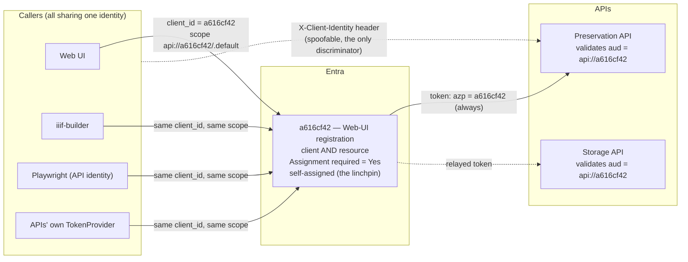
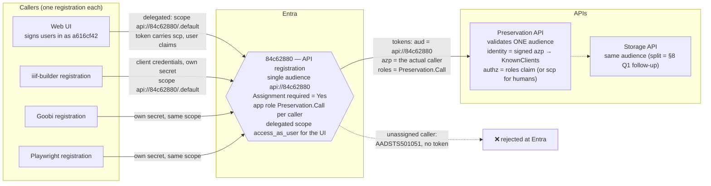
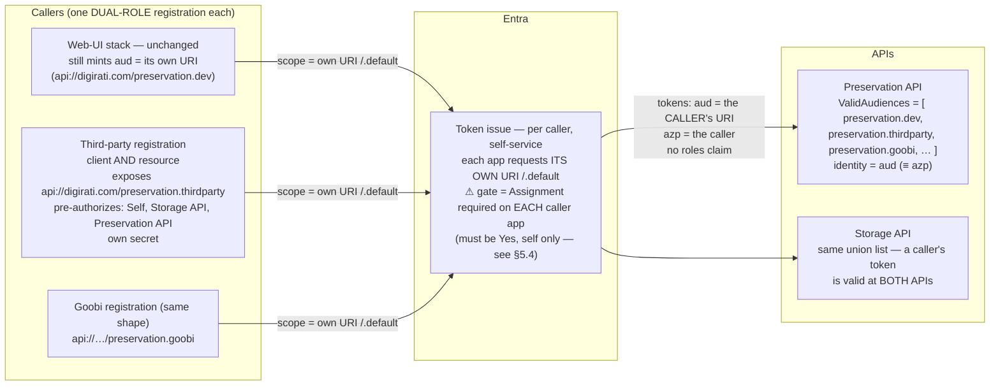

# RFC-0001 vs LPII-166: two shapes for trustworthy caller identity

| | |
|---|---|
| **Status** | Draft / for discussion |
| **Author** | Tom Crane (with assistance from Fable 5) |
| **Date** | 2026-08-24 |
| **Compares** | [`rfc-0001-api-caller-identity.md`](./rfc-0001-api-caller-identity.md) (the "Option A" proposal) with the Digirati-Entra POC in [LPII-166](https://digirati.atlassian.net/browse/LPII-166), branch [`feat/LPII-165/entra-api`](https://github.com/digirati-co-uk/digital-preservation/tree/feat/LPII-165/entra-api) |
| **Related** | [`rfc-0001-phase0-entra-admin.md`](./rfc-0001-phase0-entra-admin.md), [ADR-005 Auth setup](https://github.com/digirati-co-uk/digital-preservation-docs/blob/main/adr/005-auth-setup.md) |

## 1. Summary

LPII-166 tested the caller-identity migration on Digirati's own Entra tenant, mirroring the Leeds setup, with the stated goals of *a working external application via machine tokens* and *little or no code changes*. The experiment succeeded, and it is extremely useful — but it is not simply "the RFC, proven": underneath shared code mechanics sits a **different Entra topology**.

- **RFC-0001 (Option A)**: *one audience, N clients.* Every caller — including, eventually, the UI's downstream calls — requests a token **for the API** (`api://84c62880…/.default`). Caller identity comes from the signed `azp` claim; authorization comes from per-caller **app-role assignments** on the API registration, enforced by Entra (`Assignment required = Yes`) and by the API (role-or-scope check).
- **LPII-166**: *one audience per caller.* Each third-party caller gets a **dual-role registration** — client *and* resource — exposing its own Application ID URI (e.g. `api://digirati.com/preservation.thirdparty`) and minting tokens **for itself**. The APIs accept the **union** of caller URIs via `ValidAudiences`. The UI stack is untouched.

Put another way: RFC-0001 is a course-correction back to ADR-005 (per-API audience, app roles); LPII-166 takes the current "collapsed" pattern — where the resource identity is the *caller's* registration — and **clones it per caller**. The audience itself becomes the caller's identity.

The two agree completely on the *mechanics* (§4): the POC's `PostConfigure<JwtBearerOptions>` code is the code-side `TokenValidationParameters.ValidAudiences` form the RFC's Phase 0 already names, and it independently confirms the RFC's empirical findings. The POC's code changes work unmodified for **either** topology — the choice between §2 and §3 below is an Entra-administration and security-posture decision, not a code decision.

**Recommendation (§7): adopt the POC's mechanics; keep the RFC's topology as the target; optionally use the POC's topology as a Goobi-first stopgap** — with one non-negotiable caveat about per-caller `Assignment required` (§5.4). Two implementation defects on the POC branch need fixing before any of its code merges (§6).

## 2. Today, and the RFC-0001 target

For grounding, the current state (RFC §3): every caller authenticates *as* the Web-UI registration and requests the Web-UI registration as the audience. The spoofable `X-Client-Identity` header is the only per-caller discriminator.



RFC-0001's target: the API registration becomes the single audience; each caller is its own client, gated by an app-role assignment that Entra enforces at token issue.



The enforcement lives in **Entra**: an unassigned app never gets a token at all, and the portal's assignment list *is* the "who may call me" list (goal G4).

## 3. The LPII-166 model

Each third-party caller mirrors the Web-UI's dual-role setup: it exposes its **own** API (Application ID URI + scope), pre-authorizes **itself** (the "Self — oddity in Entra" step, which is the same self-assignment linchpin RFC §3.1 identified on `a616cf42`), and mints client-credentials tokens for its own URI. The resource APIs then accept the union of caller URIs.



Properties worth calling out:

- **The caller's identity is doubly present** — as `aud` *and* as `azp` — and both are signed. The RFC's `KnownClients`/`azp` resolution (already implemented on this branch) works unchanged in this model.
- **The allow-list moves out of Entra and into appsettings**: a caller can call an API iff its URI appears in that API's `ValidAudiences` array. Onboarding or revoking a caller means editing (and redeploying/restarting) **every** API's config, per environment.
- **No cross-app grant ever happens.** Each caller only ever talks to Entra about itself. This is why the model needs *no* admin actions on `84c62880`, no admin consent, no delegated-scope work — and it is the source of both its main advantage (§5.1) and its main risk (§5.4).
- **The Web-UI's collapsed pattern is not corrected — it is legitimised** as "the platform's own audience", one entry among N.

## 4. Where the POC confirms RFC-0001 (the shared mechanics)

The POC independently reproduces three findings from the RFC's adversarial review — this materially raises confidence in both documents:

1. **Multiple audiences only work through `TokenValidationParameters.ValidAudiences`.** The POC's "conflicting documentation on multiple audiences" remark, and its solution — `PostConfigure<JwtBearerOptions>` setting `TokenValidationParameters.ValidAudiences` — match the RFC Phase 0 CAUTION (a top-level `Audiences` key binds to nothing; verified against Microsoft.Identity.Web 3.8.3, pinned by `Storage.API.Tests/Integration/AudienceValidationTests.cs`).
2. **The self-assignment oddity is real.** The POC hit it as a required setup step ("Assign Client applications → Self"); RFC §3.1 identified the same self-entry on `a616cf42` as the linchpin that lets a registration mint app-only tokens for its own API.
3. **`AccessTokenProvider` cannot target a foreign resource without a code change.** The POC's `ResourceUri` option is exactly RFC Phase 2 option (a) / the §8 Q1 constraint — independent confirmation that migrating the `TokenProvider` callers is not config-only.

The POC also demonstrates two things the RFC had not tested:

4. **A guarded, deploy-then-activate rollout pattern** (§7.1) that is operationally safer than the RFC's config-only Phase 0 shape.
5. **Human-readable Application ID URIs** (`api://digirati.com/preservation.dev` rather than `api://<guid>`). Entra requires the URI be based on a verified domain, the tenant ID, or the client ID; within that rule readable names work fine. Adoptable under either topology; the POC's own note for Leeds is right — the current UI scope can stay as-is, readable names for anything new. The RFC's bare-GUID hardening note still applies: a v2.0 token's `aud` is the bare client GUID regardless of how pretty the `api://` URI is, so an explicit `ValidAudiences` list should consider carrying both forms.

## 5. Detailed comparison

### 5.1 Against the RFC's goals

| Goal | RFC-0001 (single audience + roles) | LPII-166 (per-caller audiences) |
|---|---|---|
| **G1** — identity from the signed token, never a header | ✅ `azp`, validated | ✅ `aud` and `azp`, both validated |
| **G2** — machine callers distinguishable and individually revocable | ✅ own registration + secret; revoke = remove role assignment (Entra) | ✅ own registration + secret; revoke = remove URI from every API's config **and/or** disable the app |
| **G3** — least privilege per caller | ✅ app roles: can-call now, read/write split available, per-endpoint roles possible (RFC §5.3.1, e.g. gating Storage `GET /content`) | ❌ binary can-call only. There is no meaningful place to define roles: a role on the caller's own registration, self-granted, is not an API-controlled permission |
| **G4** — a real, enforced "who can call me" list in the portal | ✅ the assignment list on `84c62880` *is* the list, enforced at token issue | ⚠️ the list is an appsettings array per API per environment; the portal shows N unrelated registrations. Enforced at *validation* time, not issue time |
| **G5** — incremental migration | ✅ dual-audience transition, callers move one at a time | ✅ arguably *more* incremental — each caller is purely additive; nothing existing moves at all |

### 5.2 Entra administration burden (the POC's big win)

This is where LPII-166 is decisively cheaper, and given that every action on the Leeds tenant is a negotiated admin request, it matters:

| Admin action needed | RFC-0001 | LPII-166 |
|---|---|---|
| Touch `84c62880` at all (App ID URI, app role, delegated scope) | Required (Phase 0) | **Not needed** |
| Admin consent for cross-app permissions | Required per caller (Phase 1) | **Never** — no cross-app grant exists |
| Repoint the UI's downstream scope (Phase 3) | Required, with prerequisites (delegated scope consented; every UI user assigned or `AADSTS50105`) | **Phase 3 disappears** — UI untouched |
| Strict assign-then-repoint ordering (`AADSTS501051`) | Required per caller (Phase 2) | Not applicable |
| Retire `api://a616cf42` as an audience (Phase 4) | The end state | Never happens — it stays as "the platform's audience" |
| Per new caller | Create registration, assign role, admin consent | Create dual-role registration (expose API, self-authorize, **set Assignment required — §5.4**), then edit every API's `ValidAudiences` |

For **Goobi specifically** — the RFC's driving use case — the POC model delivers a cryptographically distinct, bucket-routable identity with *one new registration and one config line per API*, touching nothing that exists.

### 5.3 What the POC model gives up

- **Preservation/Storage separation stays broken by construction.** The POC assigns both APIs to each caller's URI, so a token minted for one is valid at both — RFC §3.2 consequence #5 persists, and the §8 Q1 follow-up (Storage's own audience) has no path. Under the RFC, that split is a natural extension of the same pattern.
- **Config sprawl as the enforcement surface.** The security-critical allow-list lives in N copies of appsettings rather than one portal page; drift between Preservation's and Storage's lists, or between environments, is a quiet failure mode. (Mitigable: bind the list once in shared config, and pin it with the same style of integration test as `AudienceValidationTests` — but it is still config, not Entra.)
- **The scaling ceiling the POC itself names**: "good enough for a dozen or two external apis; beyond that API gateway type should be the way to go." The RFC model scales in Entra without config growth.
- **ADR-005 conformance.** The RFC is explicitly a course-correction back to ADR-005; the POC model formalises the drift instead. That is a legitimate choice, but it should be made knowingly, and ADR-005 amended if so.

### 5.4 ⚠️ The impersonation gate the ticket does not mention

Under the RFC model there is **one** gate to get right: `Assignment required = Yes` on `84c62880` (already set — RFC §3 warning).

Under the POC model there are **N** gates, one per caller, forever: each caller's dual-role registration must have **`Assignment required = Yes` on its own enterprise application, with only itself assigned**. Otherwise **any registration in the tenant** can request `api://…/preservation.thirdparty/.default` via client credentials, receive a valid token with that audience, and impersonate that caller at our APIs — RFC §3.1 demonstrated exactly this dynamic on `a616cf42`, where the assignment gate is the only thing preventing it.

LPII-166's write-up does not state whether the third-party registration in the Digirati mirror has this set. **This must be confirmed, and if the model is adopted anywhere it must be a mandatory onboarding step** — it is the per-caller equivalent of the single gate the RFC relies on, and it is precisely the kind of hygiene step that silently doesn't happen on the twelfth caller.

### 5.5 Rollout risk

| Risk | RFC-0001 as written | LPII-166 |
|---|---|---|
| Phase 0 config typo | `AzureAd:TokenValidationParameters:ValidAudiences` is config-only; with the singular `Audience` removed, a mis-shaped key silently falls back to ClientId-derived defaults → **outage** (the exact defect the RFC's CAUTION documents; mitigated by `AudienceValidationTests`) | Guarded code: if `Authentication:ValidAudiences` is absent or empty, nothing changes and the old `Audience` still applies → a typo **degrades to current behaviour** |
| Deploy/activate coupling | Config change is the activation | Code deploys everywhere first (inert), config activates per environment |
| `TokenProvider` migration | Explicitly flagged as not-config-only; two options offered | Implemented (option (a)) — but currently defective (§6) |

The guarded-rollout point is a genuine improvement the RFC should adopt regardless of topology (§7.1).

## 6. Defects on the POC branch

Two problems in `feat/LPII-165/entra-api` (commits `241d76b`, `8b249aa`) need fixing before any of its code merges. Neither invalidates the design — both are in `AccessTokenProvider.cs`.

### 6.1 The null-check regression breaks the "defensive deploy" claim

`AccessTokenProvider.GetAccessToken()` has a pre-existing reflection guard:

```csharp
var nullCheck = options.GetType()
    .GetProperties()
    .Select(pi => pi.GetValue(options))
    .Any(value => value == null);

if (nullCheck) { /* warn "not configured correctly" and return null */ }
```

Adding `ResourceUri` to `AccessTokenProviderOptions` means **any deployment without the new config key now fails this check** — the provider logs a warning and returns no token, so every service-to-service call that has no inbound user token to relay (the `PropagateCorrelationIdHandler` fallback path) breaks on deploy. This directly contradicts the ticket's conclusion that "as the code stands, it can be deployed with current configuration setting as it's defensive". The `Program.cs` guard *is* defensive; this isn't. Fix: exclude optional properties from the check (or replace the reflection check with explicit required-field validation).

### 6.2 The `resource` parameter targets the wrong app — and the path was likely never exercised

In the new branch:

```csharp
if (options.ResourceUri is not null)
{
    collection.Add(new("scope", $"{options.ResourceUri}/.default"));
    collection.Add(new("resource", $"{options.ClientId}"));   // ← bare CALLER guid
}
```

The request goes to `https://login.microsoftonline.com/{tenant}/oauth2/token` — the **v1** endpoint, which honours `resource` and does not use `scope`. As written, this should mint a token whose `aud` is the caller's **own** bare client GUID — a token for itself, which neither API's `ValidAudiences` list would accept. The intended line is surely `resource = ResourceUri`.

The POC's end-to-end test minted the third-party token **manually in Postman**, which bypasses this code path entirely — so the defect could sit undetected. Better than patching the line: move to the v2 endpoint (`/oauth2/v2.0/token`), where `scope={ResourceUri}/.default` is the native form and `resource` disappears — RFC Appendix B already asks for exactly this "while touching it".

### 6.3 Minor (not blocking)

- The `PostConfigure` block is duplicated verbatim in both `Program.cs` files and reads the config section twice; it should be hoisted into one extension method in `DigitalPreservation.Core` (where `AudienceValidationTests` can pin it — see §7.1).
- The `AddAuthentication(options => { DefaultAuthenticateScheme/DefaultChallengeScheme … })` change is behaviourally equivalent to the previous `AddAuthentication(JwtBearerDefaults.AuthenticationScheme)`; fine either way.

## 7. Recommended synthesis

The mechanics and the topology are separable. Take the best of each.

### 7.1 Adopt the POC's mechanics (either topology)

- **The guarded `PostConfigure` rollout pattern** replaces the RFC's config-only Phase 0 shape: deploy the code everywhere (inert without config), activate per environment by adding `ValidAudiences`, keep the old `Audience` key in place as the fallback until activation. Hoist to a single shared extension in `DigitalPreservation.Core`.
- **Config location** needs one decision: the POC's new top-level `Authentication:ValidAudiences` section vs keeping it inside `AzureAd` (e.g. `AzureAd:ValidAudiences`, read by the same guarded code). Either works; whichever is chosen, **`AudienceValidationTests` must be re-pinned to that shape** — it currently pins `AzureAd:TokenValidationParameters:ValidAudiences`, which the guarded-code approach supersedes.
- **The `ResourceUri` decoupling** in `AccessTokenProvider`, with §6's defects fixed (v2 endpoint, null-check corrected), becomes the RFC's Phase 2 option (a) implementation — and the prerequisite for a future Storage audience split (§8 Q1) under either topology.
- **Human-readable Application ID URIs** for anything newly exposed.

### 7.2 Keep the RFC's topology as the target

Single audience + per-caller app roles remains the end state, because it is the only shape that delivers G3 (least privilege, per-endpoint roles) and G4 (a portal-enforced caller list), keeps the enforcement surface in Entra rather than N config files, opens the path to Preservation/Storage audience separation, and conforms to ADR-005.

### 7.3 Optionally: the POC topology as a Goobi-first stopgap

If Leeds Entra admin throughput makes Phase 0/1 slow, the POC shape can deliver the Goobi bucket use case **now** with zero changes to `84c62880`: give Goobi a dual-role registration with its own URI, add that URI to the APIs' `ValidAudiences` (via the guarded code), and let the existing `KnownClients`/`azp` resolution and bucket routing do the rest — they work unchanged in either model. Non-negotiable conditions:

1. `Assignment required = Yes`, self-only, on the Goobi registration (§5.4) — checked, not assumed;
2. it is explicitly a stopgap: when Phase 0/1 land, Goobi repoints to `api://84c62880…/.default` like any other caller and its own URI comes back out of `ValidAudiences`. The dual-audience code makes that transition free.

## 8. Questions for Frank

1. Is **`Assignment required = Yes`** set on the third-party registration in the Digirati mirror, and is it assigned to itself only? (§5.4 — this determines whether the model has a tenant-wide impersonation hole.)
2. Was the **`ResourceUri` token path tested end-to-end** service-to-service (Preservation → Storage via `AccessTokenProvider`), or only inbound via Postman-minted tokens? (§6.2 suggests the latter.)
3. Why are **Storage API and Preservation API pre-authorized as clients** of the third-party registration? Neither API should ever request the third-party's audience; if it was belt-and-braces, dropping it tightens the model, and if it was load-bearing, that's important to understand.
4. In the mirror, is `api://digirati.com/preservation.dev` the **UI stack's own URI** (the collapsed pattern, unchanged) or the **Preservation API's**? The ticket reads as the former; it decides whether the mirror contains any single-audience element at all.
